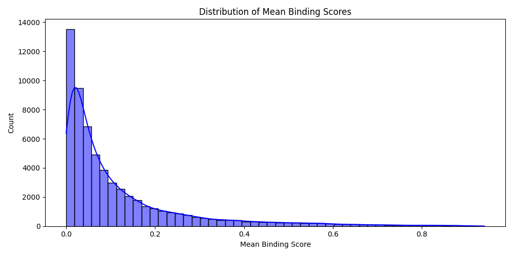

# Project Report: Peptide Binding Prediction Pipeline

## Objective
Build an end-to-end pipeline that:
- Trains a model to predict whether a peptide **binds** or **does not bind** based on its amino acid sequence.
- Accepts **arbitrary-length input sequences** for inference.
- Provides visualization and evaluation of model performance.

---

## Project Directory Overview

```
working_data/
├── data/
│   └── aggregated_data.csv            # Original CSV: peptide sequences + binding labels
│
├── npy/
│   ├── X.npy                          # Encoded sequences (shape: 60970 x 25)
│   └── y.npy                          # Corresponding labels (0 or 1)
│
├── results/
│   ├── shuffled_data.csv              # Shuffled version of input data
│   ├── roc_curve.png                  # ROC curve from model evaluation
│   └── confusion_matrix.png           # Confusion matrix from evaluation
│
├── models/
│   └── cnn_binding_model.h5           # Saved trained CNN model
│
└── scripts/
    ├── load_and_preview.py            # Load CSV and inspect structure, save shuffled version
    ├── analyze_lengths.py             # Analyze sequence length stats (all are 25)
    ├── encode_sequences.py            # Map amino acids to integers, save .npy arrays
    ├── check_arrays.py                # Confirm shapes and values of saved numpy arrays
    ├── train_model.py                 # Build + train CNN model using TensorFlow/Keras
    ├── predict_sequence.py            # Predict binding for arbitrary-length peptide input
    └── evaluate_model.py              # Generate ROC, confusion matrix, classification report
```

---

---

## File-by-File Breakdown

### load_and_preview.py
Loads and inspects the raw peptide dataset. Shuffles and saves it for training.

### analyze_lengths.py
Analyzes sequence lengths to ensure uniformity. Confirms all peptides are 25 residues long.

### encode_sequences.py
Encodes amino acids as integers and saves them as NumPy arrays.

### check_arrays.py
Verifies the structure and shape of the saved `.npy` arrays.

### train_model.py
Trains a 1D CNN on the encoded sequences and saves the trained model.

### predict_sequence.py
Predicts binding probability for arbitrary-length peptides using a sliding window strategy.

### evaluate_model.py
Evaluates model performance using ROC curve, confusion matrix, and a classification report.

### scan_windows.py
Runs a sliding 25-residue window across each peptide to identify local binding potential. Saves max and mean scores.

### plot_predictions.py
Visualizes the distribution of mean binding scores across peptides and saves the top 20 predictions.

---

## Visualization of Binding Scores

The histogram shows the distribution of mean binding scores across all peptide sequences.



Interpretation:
- Most peptides score near 0 — consistent with non-binders.
- A long tail of higher scores suggests the model identifies strong candidates.
- Top-scoring peptides are saved for follow-up analysis.

---

## Evaluation Snapshot (example output)
- Accuracy: ~90%
- AUC: ~0.90
- Binding class: ~11.5% of dataset

---
